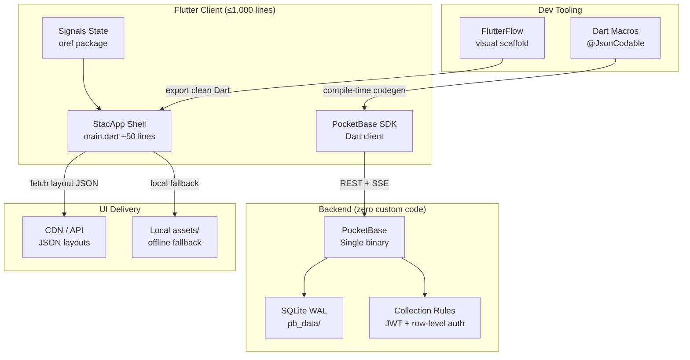
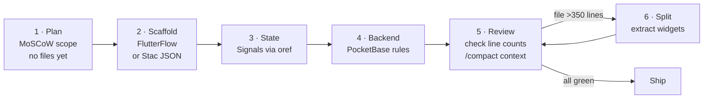
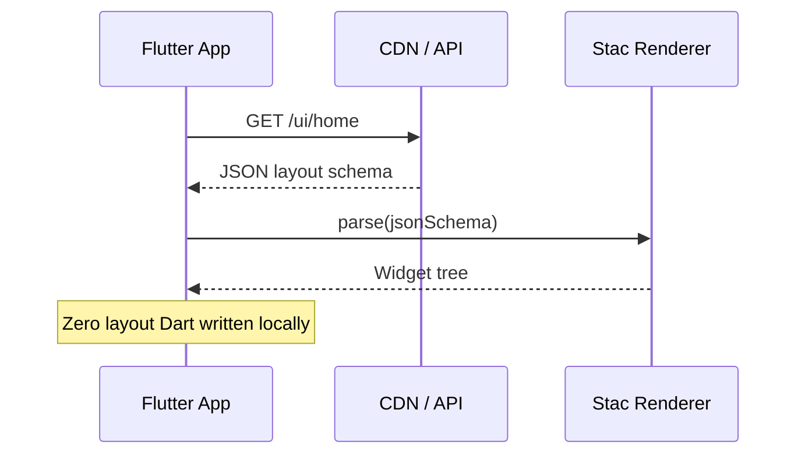
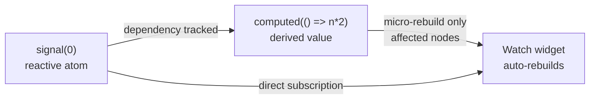
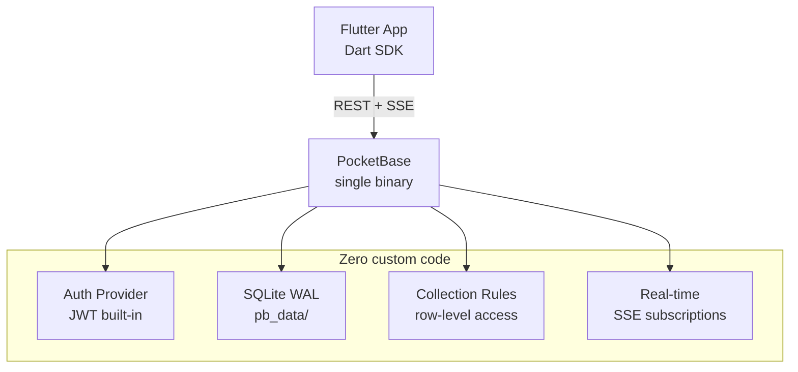
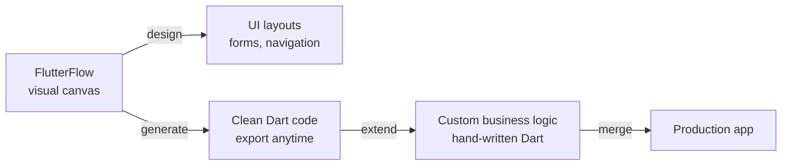
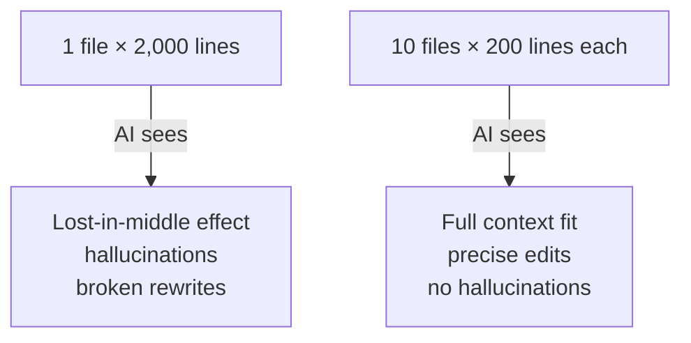
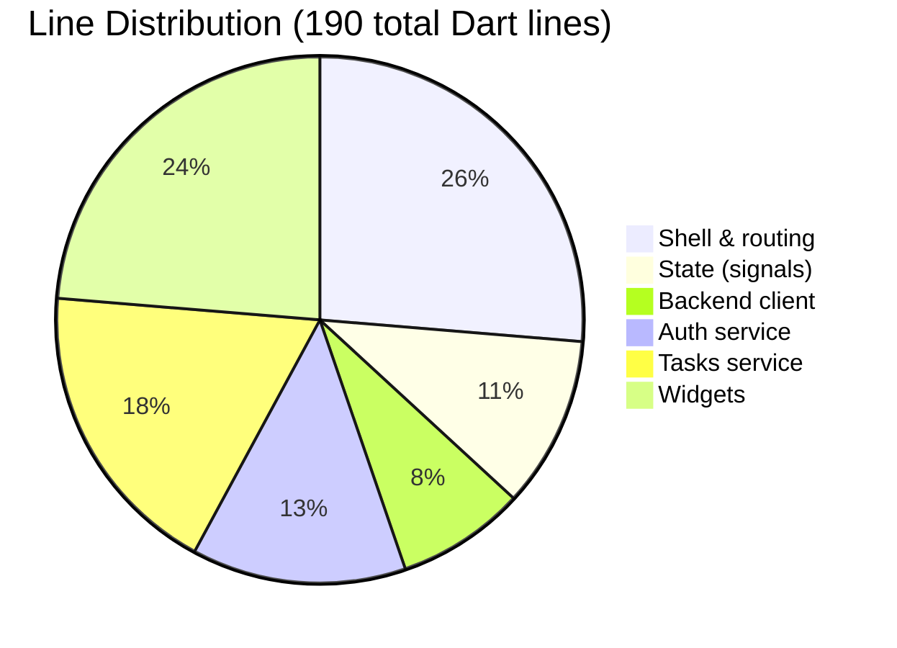

# Architecting High-Productivity Flutter Systems Under 1,000 Lines

A practical blueprint for building production-ready Flutter apps using Server-Driven UI, fine-grained signals, and lean backend patterns — optimized for both human developers and AI coding agents.

---

## Why the 1,000-Line Rule Exists

Every line of code is a liability: it must be read, understood, debugged, and maintained. When a codebase exceeds 1,000 lines per service or module, two failure modes compound each other:

1. **Human cognition degrades** — developers lose the mental model of the whole system.
2. **AI reasoning degrades** — LLM context windows fill up, causing hallucinations and broken rewrites.

The 1,000-line ceiling is a *forcing function* that pushes teams toward declarative abstractions, specialized runtimes, and server-driven patterns instead of hand-rolled boilerplate.

---

## System Architecture Overview



---

## Development Process



### Step 1 — Plan Before Touching Files

Use MoSCoW to gate scope *before* writing any Dart:

| Priority | What it means | Example |
|----------|--------------|---------|
| **Must Have** | App is broken without it | Auth, core data fetch |
| **Should Have** | Important but shippable without | Offline mode |
| **Could Have** | Nice to have, cut if tight | Dark theme |
| **Won't Have** | Out of scope now | Admin dashboard |

> **Agent instruction**: when given a feature list, output a MoSCoW table first. Do not generate files until scope is confirmed.

### Step 2 — Scaffold with Server-Driven UI

Keep the compiled binary as a dumb renderer. All layout lives on the server.

### Step 3 — State via Fine-Grained Signals

No `StatefulWidget`, no `StreamController`, no `ChangeNotifier` boilerplate.

### Step 4 — Backend via PocketBase Rules

No custom API server. Auth, CRUD, and real-time subscriptions handled declaratively.

### Step 5 — Enforce Line Budgets

| Unit | Hard limit | Action when exceeded |
|------|-----------|---------------------|
| Widget file | 350 lines | Extract sub-widgets |
| Function / method | 20 lines | Split responsibility |
| Third-party packages | 10 prod deps | Audit and prune |
| Whole service/module | 1,000 lines | Split into packages |

---

## Layer 1 — Server-Driven UI with Stac



### The Entire App Shell (~50 lines)

```dart
// main.dart
import 'package:flutter/material.dart';
import 'package:stac/stac.dart';

void main() async {
  await Stac.initialize();
  runApp(const App());
}

class App extends StatelessWidget {
  const App({super.key});

  @override
  Widget build(BuildContext context) {
    return StacApp(
      title: 'My App',
      theme: ThemeData(colorSchemeSeed: Colors.blue),
      home: Stac.fromNetwork(
        StacNetworkRequest(
          url: 'https://api.example.com/ui/home',
          method: Method.get,
        ),
      ),
    );
  }
}
```

### Offline Fallback

```dart
// Swap network fetch for bundled asset — same renderer, zero extra code.
home: Stac.fromAssets('assets/screens/home.json'),
```

### Sample Layout Schema (server-side JSON, not Dart)

```json
{
  "type": "scaffold",
  "appBar": {
    "type": "appBar",
    "title": { "type": "text", "data": "Tasks" }
  },
  "body": {
    "type": "listView",
    "children": [
      { "type": "listTile", "title": { "type": "text", "data": "Buy groceries" } },
      { "type": "listTile", "title": { "type": "text", "data": "Write tests" } }
    ]
  }
}
```

**Line savings**: a typical 10-screen app replaces ~2,000 lines of widget trees with ~50 lines of shell code.

---

## Layer 2 — State Management with Signals



### Comparison: Signals vs BLoC vs Riverpod

| | **Signals / oref** | **BLoC 9** | **Riverpod 3** |
|---|---|---|---|
| Boilerplate | Near zero | High (Events + States) | Low–Medium |
| Reactivity | Proxy, auto-tracked | Explicit stream emission | Declarative cache |
| Lifecycle cleanup | Automatic (mixins) | Manual (`close()`) | ProviderContainer |
| AI parseability | Very high | Moderate (multi-file) | High (strict codegen) |
| Lines per feature | ~5 | ~50 | ~20 |

### Counter — Full Working Example

```dart
// counter_widget.dart — 18 lines, StatelessWidget, zero boilerplate
import 'package:flutter/material.dart';
import 'package:oref/oref.dart';

class Counter extends StatelessWidget {
  const Counter({super.key});

  @override
  Widget build(BuildContext context) {
    final count = useSignal(context, 0);

    return Column(
      mainAxisAlignment: MainAxisAlignment.center,
      children: [
        Text('Count: ${count.value}', style: Theme.of(context).textTheme.headlineMedium),
        ElevatedButton(onPressed: () => count.value++, child: const Text('Increment')),
      ],
    );
  }
}
```

### Shared State Across Widgets

```dart
// app_state.dart — define once, import anywhere
import 'package:oref/oref.dart';

final currentUser = signal<String?>(null);
final taskCount  = signal(0);
final isLoading  = computed(() => currentUser.value == null);
```

```dart
// any_widget.dart — reads shared state, no Provider/InheritedWidget needed
import 'app_state.dart';

class UserBadge extends StatelessWidget {
  const UserBadge({super.key});

  @override
  Widget build(BuildContext context) {
    // Widget rebuilds only when currentUser changes
    watch(context, currentUser);
    return Text(currentUser.value ?? 'Guest');
  }
}
```

---

## Layer 3 — Compile-Time Codegen with Dart Macros

Traditional `freezed` + `json_serializable` workflow:

```
dart run build_runner build  →  generates *.g.dart files  →  commits noise to git
```

Modern macro workflow:

```
dart compile  →  generates code in memory  →  zero disk artifacts
```

### Before (freezed — ~40 lines of boilerplate per model)

```dart
// user.dart + user.freezed.dart + user.g.dart — three files, 40+ lines
@freezed
class User with _$User {
  factory User({required String name, required int age}) = _User;
  factory User.fromJson(Map<String, dynamic> json) => _$UserFromJson(json);
}
```

### After (Dart Macros — 6 lines, no generated files)

```dart
// user.dart — single file, compile-time generation
import 'package:json/json.dart';

@JsonCodable()
class User {
  final String name;
  final int age;
}
```

### Extension Types — Zero-Cost Domain Wrappers

```dart
// Wraps String with domain semantics, compiled away at runtime
extension type TaskId(String value) {
  bool get isValid => value.isNotEmpty;
}

extension type EmailAddress(String value) {
  bool get isValid => value.contains('@');
}

// Usage — type-safe, zero overhead
void sendInvite(EmailAddress email, TaskId task) { ... }
```

---

## Layer 4 — Backend with PocketBase



### Setup — One Command

```bash
# Download and run — replaces an entire Node/Express/Postgres stack
./pocketbase serve
# Admin UI at http://127.0.0.1:8090/_/
```

### Client Initialization (~10 lines)

```dart
// pb_client.dart
import 'package:pocketbase/pocketbase.dart';

final pb = PocketBase('https://api.example.com');

// Auth state persists across app restarts via AsyncAuthStore
final pb = PocketBase(
  'https://api.example.com',
  authStore: AsyncAuthStore(
    save: (data) => prefs.setString('pb_auth', data),
    initial: prefs.getString('pb_auth'),
  ),
);
```

### Authentication (~15 lines)

```dart
// auth_service.dart
import 'pb_client.dart';

Future<void> signIn(String email, String password) async {
  await pb.collection('users').authWithPassword(email, password);
}

Future<void> signOut() async {
  pb.authStore.clear();
}

bool get isLoggedIn => pb.authStore.isValid;
```

### CRUD Operations (~20 lines)

```dart
// tasks_service.dart
import 'pb_client.dart';

Future<List<RecordModel>> fetchTasks() =>
    pb.collection('tasks').getFullList(sort: '-created');

Future<RecordModel> createTask(String title) =>
    pb.collection('tasks').create(body: {'title': title, 'done': false});

Future<void> toggleTask(String id, bool done) =>
    pb.collection('tasks').update(id, body: {'done': done});

Future<void> deleteTask(String id) =>
    pb.collection('tasks').delete(id);
```

### Real-Time Subscriptions (~12 lines)

```dart
// realtime_service.dart
import 'pb_client.dart';
import 'app_state.dart';

void subscribeToTasks() {
  pb.collection('tasks').subscribe('*', (event) {
    // event.action: "create" | "update" | "delete"
    taskCount.value += event.action == 'create' ? 1 : 0;
  });
}

void dispose() => pb.collection('tasks').unsubscribe();
```

### Collection Rules (Admin UI — no code)

```
// tasks collection API rules — set in PocketBase Admin UI
List:   @request.auth.id != ""
View:   @request.auth.id != "" && record.user = @request.auth.id
Create: @request.auth.id != ""
Update: record.user = @request.auth.id
Delete: record.user = @request.auth.id
```

**Line savings**: replaces ~300+ lines of Express/Fastify routes, JWT middleware, and ORM setup.

---

## Layer 5 — Visual Scaffolding with FlutterFlow



### When to Use FlutterFlow

| Use FlutterFlow for | Write Dart by hand for |
|---------------------|----------------------|
| Auth screens (login, signup) | Complex animations |
| Standard CRUD forms | Custom plugins / platform channels |
| Onboarding flows | Business logic / algorithms |
| Rapid prototyping | Real-time subscription handlers |
| Navigation structure | Performance-critical rendering |

### FlutterFlow + Stac Hybrid

- Build *structural* screens in FlutterFlow (navigation, auth)
- Serve *content* screens as Stac JSON from the backend
- Merge: FlutterFlow scaffold + Stac renderer + Signals state

---

## Context Engineering for AI Agents

When you use Claude Code, Windsurf, or Copilot to co-author this app, codebase structure directly affects AI accuracy.



### Token Cost Model (plain text, no broken images)

Each AI request accumulates:
- System prompt tokens (fixed)
- All open file tokens (grows with file size)
- Conversation history tokens (grows per turn)
- Tool outputs (grows with each tool call)

**Rule**: if every file is ≤350 lines, the entire active context fits comfortably in a single LLM context window. Files over 1,000 lines each force the AI to work with partial views — causing errors.

### Agent Instructions Embedded in Code

Write files so the AI can parse intent from structure alone:

```dart
// GOOD — AI knows exactly what this file owns
// tasks_service.dart: CRUD operations for the tasks collection
// Dependencies: pb_client.dart, app_state.dart
// Max file size: 100 lines

// BAD — monolithic file, AI loses track of responsibilities
// home_screen.dart: 900 lines mixing UI, state, API calls, and routing
```

### Context Management Commands

| Situation | Action |
|-----------|--------|
| Conversation history > 50 turns | Run `/compact` in Claude Code |
| AI hallucinates existing functions | Run `/clear`, re-attach only relevant files |
| Context window warning | Append summary to `CLAUDE.md`, flush history |
| New session on existing project | AI reads `CLAUDE.md` for full context |

### CLAUDE.md Template

```markdown
# Project Context

## Stack
- Flutter + Stac (SDUI) + oref (signals) + PocketBase

## File Budget
- Widget files: ≤350 lines
- Service files: ≤150 lines  
- Functions: ≤20 lines

## Active Features
- [x] Auth (email/password via PocketBase)
- [x] Task list (real-time SSE)
- [ ] Offline mode (Stac local assets)

## Key Files
- main.dart — StacApp shell (50 lines)
- pb_client.dart — PocketBase singleton
- app_state.dart — global signals
- tasks_service.dart — CRUD + subscriptions
```

---

## Complete Project Structure

```
my_app/
├── lib/
│   ├── main.dart                 # ~50 lines  — StacApp shell
│   ├── pb_client.dart            # ~15 lines  — PocketBase singleton
│   ├── app_state.dart            # ~20 lines  — global signals
│   ├── services/
│   │   ├── auth_service.dart     # ~25 lines
│   │   └── tasks_service.dart    # ~35 lines
│   └── widgets/
│       ├── user_badge.dart       # ~20 lines
│       └── task_tile.dart        # ~25 lines
├── assets/
│   └── screens/
│       └── home.json             # Stac offline fallback
├── pubspec.yaml                  # ≤10 prod dependencies
└── CLAUDE.md                     # AI context anchor
```

**Total Dart**: ~190 lines. Well under the 1,000-line ceiling.

---

## Line Budget Tracker



---

## Actionable Checklist

### Before writing code
- [ ] Define MoSCoW scope, get sign-off
- [ ] Create `CLAUDE.md` with stack and file budget

### UI layer
- [ ] Implement `StacApp` shell in `main.dart` (≤50 lines)
- [ ] Publish first screen as JSON to CDN or `assets/`
- [ ] Add offline fallback via `Stac.fromAssets()`

### State layer
- [ ] Install `oref` package
- [ ] Define global signals in `app_state.dart`
- [ ] Replace any `StatefulWidget` with `useSignal(context, ...)`

### Data layer
- [ ] Deploy PocketBase (single binary)
- [ ] Create collections in Admin UI
- [ ] Set row-level API rules in Admin UI (no code)
- [ ] Connect via `pocketbase` Dart SDK

### Codegen
- [ ] Enable Dart Macros in `dart_experiment_flags`
- [ ] Annotate models with `@JsonCodable()`
- [ ] Remove `freezed` / `json_serializable` / `build_runner`

### Quality gates
- [ ] No widget file exceeds 350 lines
- [ ] No function exceeds 20 lines
- [ ] Total prod dependencies ≤ 10 packages
- [ ] `CLAUDE.md` updated before each AI session

---

## Package Reference

```yaml
# pubspec.yaml — production dependencies (10 max)
dependencies:
  flutter:
    sdk: flutter

  # SDUI renderer
  stac: ^1.0.0

  # Fine-grained state
  oref: ^0.5.0

  # Backend client
  pocketbase: ^0.18.0

  # Compile-time JSON (experimental)
  json: ^0.20.0          # provides @JsonCodable
```

> **Note**: `Dart Macros` and `@JsonCodable` require `dart >= 3.4` with `macros` experiment flag enabled in `analysis_options.yaml`.

---

## Key Principles (Summary)

1. **Code is a liability** — every line added is a line that must be maintained and understood by both humans and AI.
2. **Declare, don't impeach** — use JSON schemas, collection rules, and reactive signals instead of imperative controllers.
3. **Files are context units** — structure files so each one fits in an AI's focused attention; 350 lines is the safe upper bound.
4. **Server-drive the variable, compile the stable** — layouts change often (server), auth logic rarely does (compiled).
5. **Anchor the AI** — maintain `CLAUDE.md` as a living context file; flush conversation history regularly with `/compact`.
