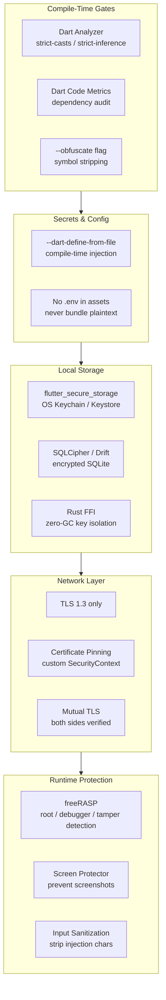
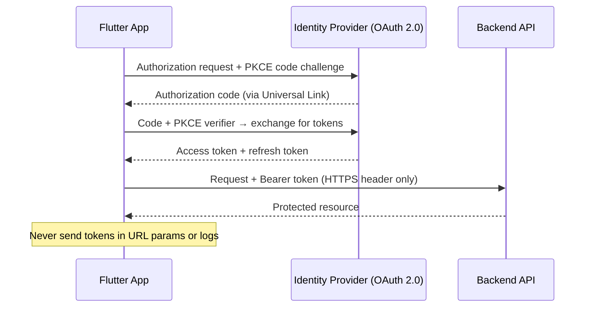
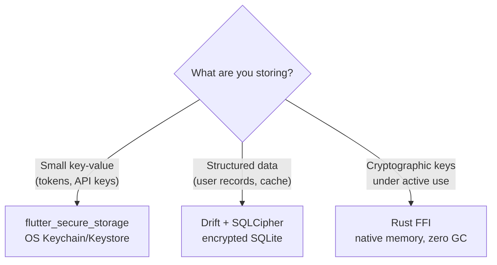
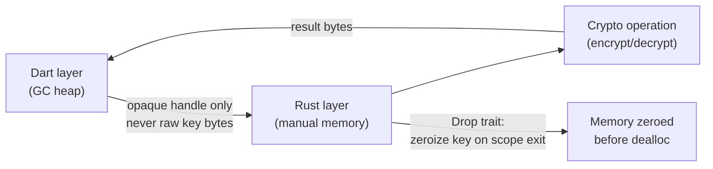
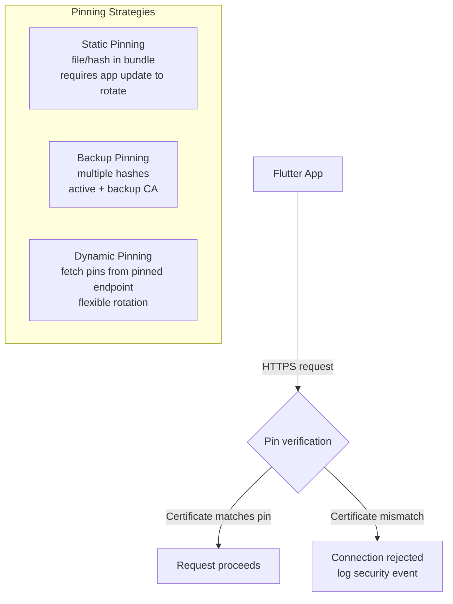
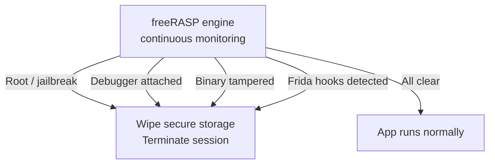
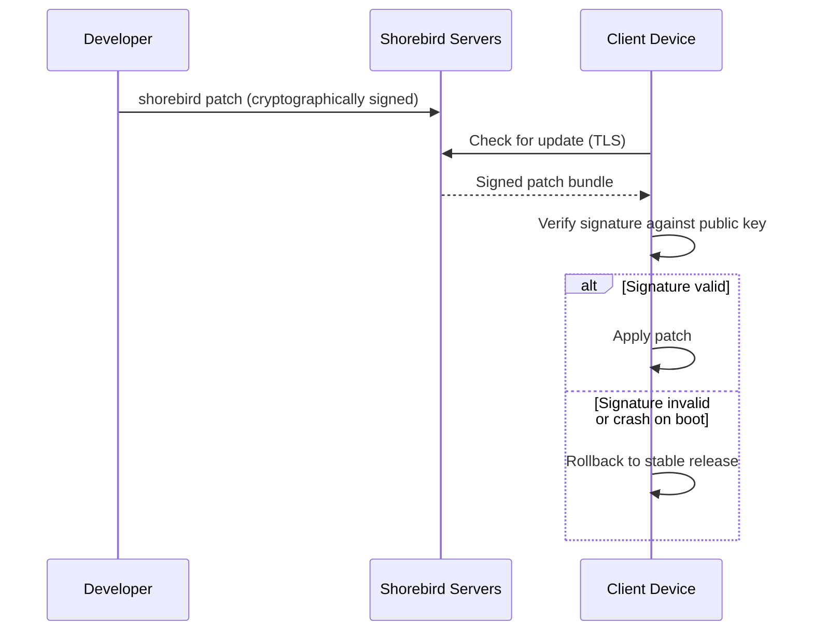
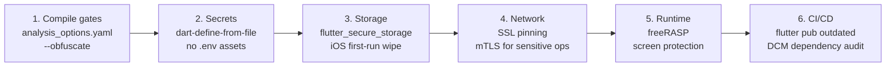

# Flutter App Security: Architecture, SDLC, and Implementation Guide

A practical, layer-by-layer blueprint for hardening Flutter apps — from compile-time analysis through runtime self-protection.

---

## Full Security Stack Overview



---

## Why Traditional Security Testing Fails for Flutter

Flutter compiles Dart to native AOT machine code. This changes every assumption traditional security tools rely on.

| Testing Dimension | Traditional Tools | Flutter Reality |
|---|---|---|
| Static analysis artifact | Source or JVM bytecode | Flat native ARM binary — no class metadata |
| Dynamic instrumentation | JVM / ObjC runtime hooks | AOT removes runtime hooks entirely |
| UI automation | Native view hierarchy (UIKit / Views) | Custom Skia/Impeller canvas — no view tree |
| Dependency graph tracing | Build-time classpath | Binary-first static analysis required |

**Consequence**: a Flutter app can pass every traditional SAST/DAST scan and still ship vulnerable code. Security must be enforced at compile-time and architecture level, not tooling alone.

---

## Shift-Left: Static Analysis as a Compile-Time Gate

Add to `analysis_options.yaml` at the project root:

```yaml
include: package:flutter_lints/flutter.yaml

analyzer:
  language:
    strict-casts: true       # fails on implicit type coercion (e.g. List<Object> → List<String>)
    strict-inference: true   # flags loosely inferred types
    strict-raw-types: true   # requires explicit generics: Map<String, dynamic> not Map

linter:
  rules:
    avoid_print: true        # catches raw print() calls in production code
    always_declare_return_types: true
```

For enterprise quality gates, add [Dart Code Metrics (DCM)](https://dcm.dev) to CI:

```bash
dart pub global activate dart_code_metrics
dart run dart_code_metrics:metrics analyze lib --reporter=console
```

DCM detects: cyclomatic complexity, memory leaks, dead code, and unused/over-privileged dependencies.

---

## Identity, Access Control, and Deep Links



### Platform Permissions — Least Privilege

```dart
// permissions_service.dart
import 'package:permission_handler/permission_handler.dart';

Future<void> requestCamera() async {
  final status = await Permission.camera.request();

  if (status.isGranted) {
    // proceed
  } else if (status.isDenied) {
    // degrade gracefully — do not crash
  } else if (status.isPermanentlyDenied) {
    await openAppSettings(); // guide user to OS settings
  }
}
```

### Deep Link Security: Universal Links over Custom Schemes

Custom URI schemes (`myapp://`) can be hijacked by any app on the device. Use verified HTTPS links instead:

| Scheme | Hijackable | OS Verification |
|---|---|---|
| `myapp://profile` | Yes — any app can register it | None |
| `https://example.com/profile` (Universal/App Link) | No — domain verified by OS at install | Cryptographic handshake with `/.well-known/assetlinks.json` |

---

## Secrets and Configuration Management

### The `.env` Asset Trap

```yaml
# INSECURE — do not do this
flutter:
  assets:
    - .env   # APK/IPA are ZIP archives — anyone can unzip and read this
```

### Secure Pattern: Compile-Time Injection

**Step 1** — create `config.json` (add to `.gitignore`):

```json
{
  "API_BASE_URL": "https://api.example.com",
  "OAUTH_CLIENT_ID": "prod_client_9921"
}
```

**Step 2** — inject at build time:

```bash
flutter build apk --dart-define-from-file=config.json
flutter build ipa --dart-define-from-file=config.json
```

**Step 3** — read as compile-time constants (never runtime strings):

```dart
// config.dart
class Config {
  static const apiBaseUrl = String.fromEnvironment(
    'API_BASE_URL',
    defaultValue: 'https://staging.api.example.com',
  );
  static const oauthClientId = String.fromEnvironment('OAUTH_CLIENT_ID');
}
```

### Production Log Sanitization

```dart
// logger.dart
import 'package:flutter/foundation.dart';
import 'dart:developer' as dev;

void secureLog(String message) {
  // developer.log is stripped from release builds by the tree-shaker
  dev.log(message, name: 'com.example.app');

  // Belt-and-suspenders: also guard with kDebugMode
  if (kDebugMode) print(message);
}

// NEVER call this with tokens, PII, or credentials:
// secureLog('token=${user.accessToken}');  ← this leaks to logcat/syslog
```

| Control | Insecure Pattern | Secure Pattern |
|---|---|---|
| Secrets | `.env` in `pubspec.yaml` assets | `--dart-define-from-file` |
| Logging | `print(token)` unconditionally | `kDebugMode` guard + `dev.log()` |
| Deep links | Custom URI scheme | Universal Link / App Link |

---

## Secure Local Storage



### flutter_secure_storage — Singleton with Typed Keys

```dart
// secure_storage.dart
import 'package:flutter_secure_storage/flutter_secure_storage.dart';

class SecureStorage {
  SecureStorage._();
  static final SecureStorage instance = SecureStorage._();

  static const _store = FlutterSecureStorage(
    aOptions: AndroidOptions(
      encryptedSharedPreferences: true, // required — prevents legacy RSA fallback
    ),
  );

  Future<void> write(StorageKey key, String value) =>
      _store.write(key: key.name, value: value);

  Future<String?> read(StorageKey key) async {
    try {
      return await _store.read(key: key.name);
    } catch (_) {
      return null; // handle key-rotation corruption gracefully
    }
  }

  Future<void> delete(StorageKey key) => _store.delete(key: key.name);
  Future<void> deleteAll() => _store.deleteAll();
}

enum StorageKey { accessToken, refreshToken, userProfile }
```

### iOS Keychain Persistence — First-Run Wipe

On iOS, Keychain data survives app uninstallation. A reinstalled app inherits stale tokens.

```dart
// app_init.dart
import 'package:shared_preferences/shared_preferences.dart';
import 'secure_storage.dart';

Future<void> handleFirstLaunch() async {
  final prefs = await SharedPreferences.getInstance();
  // SharedPreferences IS cleared on uninstall; Keychain is NOT
  final isFirstRun = prefs.getBool('first_run') ?? true;

  if (isFirstRun) {
    await SecureStorage.instance.deleteAll(); // wipe stale keychain data
    await prefs.setBool('first_run', false);
  }
}
```

### Dynamic Key Wrapping for Encrypted Databases

1. Generate a high-entropy key via `dart:math` `Random.secure()` or a Rust CSPRNG
2. Store the key in `flutter_secure_storage` (hardware-backed)
3. Retrieve the key at runtime to open the encrypted database
4. Immediately zero the plaintext key bytes from Dart heap after use

---

## Memory Isolation via Rust FFI

Dart's garbage collector does not deterministically clear memory. Cryptographic key material can linger in heap until the next GC cycle — exposable via a memory dump on rooted devices.



```dart
// ffi_crypto.dart
import 'dart:ffi';
import 'dart:isolate';

// Run Rust FFI on a background isolate to avoid blocking the render thread
Future<Uint8List> secureDecrypt(
  Uint8List ciphertext,
  Pointer<Void> opaqueKeyHandle,
) async {
  return Isolate.run(() => nativeDecryptWithOpaqueKey(ciphertext, opaqueKeyHandle));
}
```

The Rust `Drop` implementation on the key struct calls `zeroize()` before deallocation — no plaintext key remnants remain in any accessible memory region.

---

## Screen and Input Protection

```dart
// screen_protection.dart
import 'package:screen_protector/screen_protector.dart';

Future<void> enableScreenProtection() async {
  await ScreenProtector.preventScreenshotOn();  // blocks screenshots + recording
  await ScreenProtector.protectScreenOn();       // blurs app in OS task switcher
}

Future<void> disableScreenProtection() async {
  await ScreenProtector.preventScreenshotOff();
  await ScreenProtector.protectScreenOff();
}
```

```dart
// input_sanitizer.dart

String sanitizeInput(String raw) {
  // Strip characters used in SQL injection, XSS, and shell injection
  return raw
      .replaceAll(RegExp(r"[<>\"';\\]"), '')
      .replaceAll(RegExp(r'--'), '')
      .trim();
}
```

---

## Network Security: SSL/TLS Certificate Pinning



### Dio with Custom SecurityContext

```dart
// network_client.dart
import 'dart:io';
import 'package:dio/dio.dart';
import 'package:flutter/services.dart' show rootBundle;

Future<Dio> createSecureDio() async {
  final certBytes = await rootBundle.load('assets/certs/server.pem');

  final context = SecurityContext(withTrustedRoots: false); // disable system CAs
  context.setTrustedCertificatesBytes(certBytes.buffer.asUint8List());

  final httpClient = HttpClient(context: context);

  return Dio()
    ..httpClientAdapter = IOHttpClientAdapter(
      createHttpClient: () => httpClient,
    );
}
```

### Pinning Lifecycle Strategies

| Strategy | Rotation | Risk | Use When |
|---|---|---|---|
| **Static** | App store update required | Pin expiry kills traffic | Internal enterprise apps |
| **Backup** | Pre-register backup CA hash | Low — fallback active | Consumer apps, regular cert rotation |
| **Dynamic** | Remote config endpoint | Bootstrap must itself be pinned | Large orgs with frequent rotation |

### Defending Against Kernel-Level Bypass

On rooted devices, attackers can redirect traffic at the kernel level via `iptables` NAT rules, bypassing Flutter's user-space pinning entirely. Defense layers:

1. **Active environment scan** — detect VPN tunnels, proxy routes, and network anomalies at startup
2. **Mutual TLS (mTLS)** — require the client to present a certificate the server validates
3. **RASP integration** — treat root detection as a trigger to terminate the session (see below)

---

## RASP and Anti-Reverse Engineering



### Why Simple Boolean Checks Fail

A static root-check function like `checkForRoot()` in a shared library can be located with Ghidra, patched to always return `0`, and pushed back onto the device. The check is neutralized without touching Dart code.

**Solution**: use a streaming RASP engine that monitors continuously, not at a single call site.

### freeRASP Integration with Riverpod

```dart
// security_provider.dart
import 'package:flutter_riverpod/flutter_riverpod.dart';
import 'package:freerasp/freerasp.dart';

enum Threat { none, rootDetected, debuggerAttached, binaryTampered, fridaHooked }

// StreamProvider exposes a live threat feed to any widget
final threatProvider = StreamProvider<Threat>((ref) async* {
  final config = TalsecConfig(
    androidConfig: AndroidConfig(
      packageName: 'com.example.app',
      signingCertHashes: ['YOUR_CERT_SHA256_HASH'],
    ),
    iosConfig: IOSConfig(
      bundleIds: ['com.example.app'],
      teamId: 'YOUR_TEAM_ID',
    ),
  );

  final controller = StreamController<Threat>();

  Talsec.instance.attachListener(ThreatCallback(
    onPrivilegedAccess: () => controller.add(Threat.rootDetected),
    onDebug:            () => controller.add(Threat.debuggerAttached),
    onAppTamper:        () => controller.add(Threat.binaryTampered),
    onHooks:            () => controller.add(Threat.fridaHooked),
  ));

  await Talsec.instance.start(config);
  ref.onDispose(controller.close);

  yield* controller.stream;
});
```

```dart
// security_guard.dart — react to threats in the widget tree
class SecurityGuard extends ConsumerWidget {
  final Widget child;
  const SecurityGuard({required this.child, super.key});

  @override
  Widget build(BuildContext context, WidgetRef ref) {
    ref.listen(threatProvider, (_, next) {
      next.whenData((threat) {
        if (threat != Threat.none) {
          SecureStorage.instance.deleteAll();      // wipe tokens
          Navigator.of(context).pushNamedAndRemoveUntil('/locked', (_) => false);
        }
      });
    });
    return child;
  }
}
```

---

## Supply Chain and OTA Security



### Supply Chain Audit Commands

```bash
# Check for outdated or vulnerable packages
flutter pub outdated

# Review what permissions each package requests
# (manual review — check AndroidManifest.xml merges and Info.plist additions)

# Remove packages that are no longer used
dart fix --apply
```

### Build Chain Ordering (Shorebird + GuardSquare)

Post-compilation security tools (obfuscators, RASP injectors) **must run during compilation**, not after. Shorebird registers a reference binary at compile time to compute patches. If a security tool modifies the binary after Shorebird's reference snapshot, patches will be incompatible and break OTA delivery.

---

## Actionable Security Roadmap



**Checklist**

- [ ] `strict-casts`, `strict-inference`, `strict-raw-types` enabled in `analysis_options.yaml`
- [ ] `--obfuscate --split-debug-info=./debug-symbols` in all release builds
- [ ] No `.env` files in `pubspec.yaml` assets block — use `--dart-define-from-file`
- [ ] All `print()` calls guarded by `kDebugMode` or replaced by `dev.log()`
- [ ] `flutter_secure_storage` with `encryptedSharedPreferences: true` on Android
- [ ] iOS first-run Keychain wipe implemented
- [ ] Universal Links / Android App Links replacing all custom URI schemes
- [ ] Dio configured with custom `SecurityContext(withTrustedRoots: false)` + pinned cert
- [ ] Backup pin hash registered for certificate rotation
- [ ] `freeRASP` active with threat callbacks wiring to session termination
- [ ] `ScreenProtector.preventScreenshotOn()` enabled for sensitive screens
- [ ] `flutter pub outdated` runs in CI before every release build
- [ ] Shorebird patches signed and validated before OTA delivery
