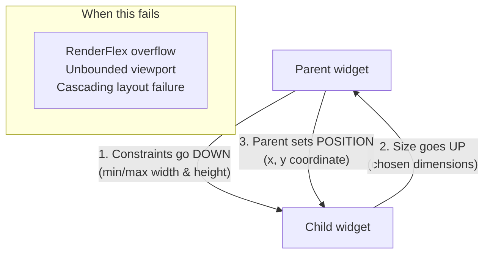
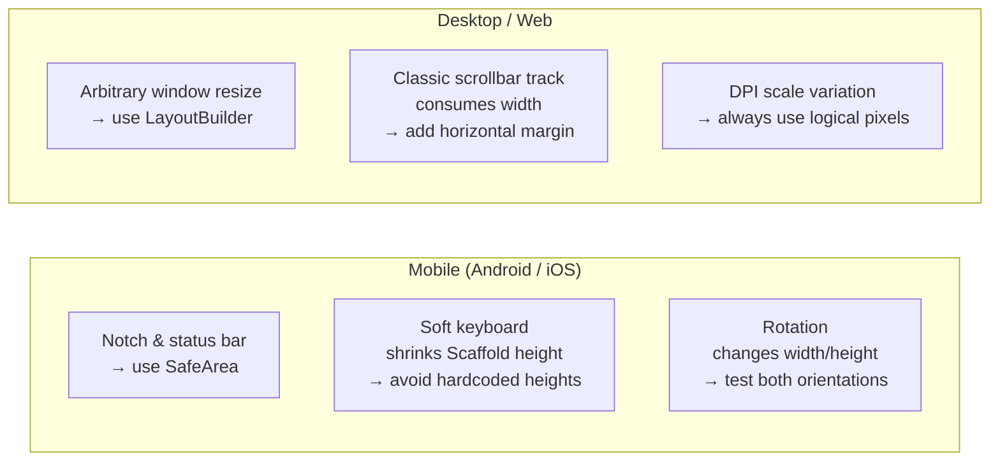
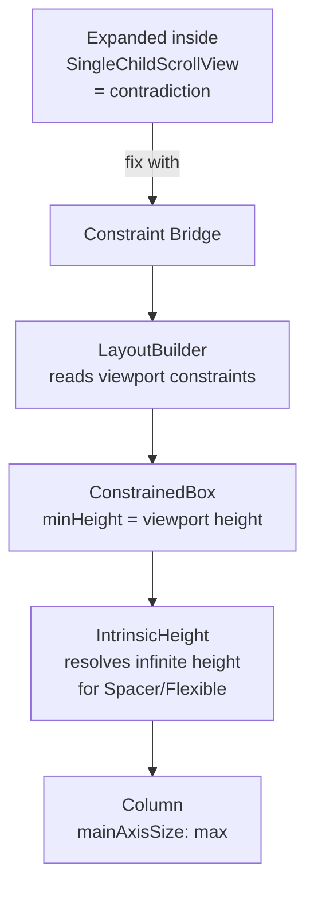
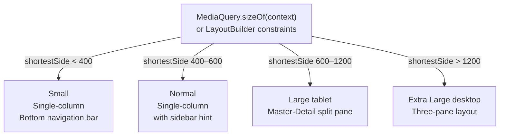

# Flutter Overflow & Pixel Prevention Guide

A systematic reference for diagnosing and fixing layout overflows across mobile, desktop, and web — with constraint mechanics, code patterns, and debugging tools.

---

## How Flutter's Layout Engine Works

Flutter uses a single-pass depth-first layout algorithm with three rules:



**The golden rule**: a child can only choose a size *within* the constraints its parent gives it. When a child requests more space than allowed, Flutter throws a layout overflow.

---

## Common Constraint Violations

| Error | Diagnostic Message | Cause | Fix |
|---|---|---|---|
| **RenderFlex overflow** | `A RenderFlex overflowed by N pixels` | Child of `Row`/`Column` is larger than allocated space | Wrap child in `Expanded` or `Flexible` |
| **Unbounded height** | `Vertical viewport was given unbounded height` | `ListView` inside `Column` with no height constraint | Wrap `ListView` in `Expanded` or give it a fixed `SizedBox` height |
| **Unbounded width input** | `An InputDecorator cannot have an unbounded width` | `TextField` inside unconstrained `Row` | Wrap `TextField` in `Expanded` or `Flexible` |
| **Wrong ParentData** | `Incorrect use of ParentData widget` | `Expanded` used outside `Row`/`Column`, or `Positioned` outside `Stack` | Move to correct parent hierarchy |
| **RenderBox not laid out** | `RenderBox was not laid out` | Downstream cascade from a parent constraint failure | Fix the root constraint error — this one resolves itself |

---

## Platform-Specific Overflow Triggers



### Mobile: Soft Keyboard Overflow

When the keyboard appears, `Scaffold` shrinks. Hardcoded `Container` heights cause a bottom overflow:

```dart
// GOOD — let Flutter distribute remaining space
Scaffold(
  resizeToAvoidBottomInset: true, // default: true — keep it
  body: SingleChildScrollView(    // scrollable so content isn't clipped
    child: Column(children: [...]),
  ),
)
```

### Desktop/Web: Scrollbar Track Overflow

On desktop, Flutter adds a physical scrollbar track that consumes width. If your layout has no margin buffer, the track triggers a `RenderFlex` overflow:

```dart
// Add horizontal padding to account for the scrollbar track width
Padding(
  padding: EdgeInsets.only(right: 16), // reserve scrollbar track space
  child: Row(children: [...]),
)
```

---

## The Viewport-Flex Paradox

`Expanded` inside a `SingleChildScrollView` is a contradiction: `Expanded` consumes a proportional share of *finite* space, but a scroll view provides *infinite* space in the scroll direction. This causes: `RenderFlex children have non-zero flex but incoming height constraints are unbounded`.



```dart
// constraint_bridge.dart — resolves Expanded-in-ScrollView paradox
LayoutBuilder(
  builder: (context, viewportConstraints) {
    return SingleChildScrollView(
      child: ConstrainedBox(
        constraints: BoxConstraints(
          minHeight: viewportConstraints.maxHeight, // at least as tall as viewport
          maxHeight: double.infinity,               // can grow beyond viewport
        ),
        child: IntrinsicHeight(
          child: Column(
            mainAxisSize: MainAxisSize.max,
            children: [
              const SomeContent(),
              const Spacer(), // works now — IntrinsicHeight resolves the height
              const Footer(),
            ],
          ),
        ),
      ),
    );
  },
)
```

> **Performance note**: `IntrinsicHeight` performs a speculative layout pass before the real one — O(n²) complexity in deeply nested trees. Use it only when children cannot be constrained with simple box constraints. Never put it inside a `ListView`.

---

## Waterfall and Grid Layouts

For masonry/waterfall grids, use `staggered_flow_grid` — it uses a shortest-column algorithm that:
- Requires no height hints from child widgets
- Computes intrinsic heights internally
- Supports `computeDryLayout` for dynamic containers
- Uses `RepaintBoundary` to minimize cross-column repaints

---

## Fluid Line Wrapping with `Wrap` and `WrapSuper`

When horizontal space runs out, a `Row` overflows. `Wrap` automatically reflows children to the next line.

```dart
// Replace a Row that overflows with Wrap
Wrap(
  spacing: 8,    // horizontal gap between children
  runSpacing: 8, // vertical gap between lines
  children: categoryChips,
)
```

For fine-grained proportional sizing within each line, use `WrapSuper` from `assorted_layout_widgets`:

| `wrapFit` Value | Behavior | Best For |
|---|---|---|
| `min` | Children keep their natural intrinsic width | Tags, simple buttons |
| `divided` | All children in a line share equal width | Grid cards across varying window sizes |
| `proportional` | Scale proportionally to fill the line | Image tiles — preserves aspect ratios |
| `larger` | Scale only smaller children; keep large ones at natural size | Mixed short/long text chips |

---

## Text Overflow Prevention

Text in a `Row` or `Column` assumes infinite main-axis space unless constrained.

```dart
// Always wrap Text in Expanded/Flexible when inside Row/Column
Row(
  children: [
    const Icon(Icons.person),
    Expanded(                         // gives Text a finite width
      child: Text(
        dynamicUserName.replaceAll('\n', ' '), // strip newlines to preserve single-line bounds
        maxLines: 1,
        softWrap: false,
        overflow: TextOverflow.ellipsis,
      ),
    ),
  ],
)
```

### TextOverflow Strategy Comparison

| Strategy | Visual Behavior | Performance | Use When |
|---|---|---|---|
| `clip` | Abrupt cut at boundary, no indicator | Lightest | Rigid fixed-size labels where truncation is obvious |
| `ellipsis` | Appends `...` at boundary | Moderate | Chat lists, card titles, user names |
| `fade` | Opacity gradient toward boundary | Heaviest (opacity layer) | Single-line decorative text |
| `visible` | Draws outside parent bounds | Moderate | Debug only — never ship this |

> **`fade` + `softWrap: false`**: raw `\n` characters bypass `softWrap: false` and cause vertical clipping. Always sanitize: `text.replaceAll('\n', ' ')`.

### Auto-Scaling Text

```dart
// Scales font down to fit; never overflows
FittedBox(
  fit: BoxFit.scaleDown,
  alignment: Alignment.centerLeft,
  child: Text(dynamicLabel, style: const TextStyle(fontSize: 20)),
)
```

For a minimum font threshold before falling back to ellipsis, use `auto_size_text`:

```dart
AutoSizeText(
  dynamicLabel,
  minFontSize: 12,
  maxLines: 2,
  overflow: TextOverflow.ellipsis,
)
```

---

## Multi-Platform Responsive Layout



### ScreenSize Breakpoint Enum

```dart
// screen_size.dart
enum ScreenSize {
  small(400.0),
  normal(600.0),
  large(1200.0),
  extraLarge(double.infinity);

  final double maxShortestSide;
  const ScreenSize(this.maxShortestSide);

  static ScreenSize of(BuildContext context) {
    final side = MediaQuery.sizeOf(context).shortestSide;
    if (side < small.maxShortestSide) return small;
    if (side < normal.maxShortestSide) return normal;
    if (side < large.maxShortestSide) return large;
    return extraLarge;
  }
}
```

```dart
// adaptive_layout.dart
class AdaptiveLayout extends StatelessWidget {
  const AdaptiveLayout({super.key});

  @override
  Widget build(BuildContext context) {
    final size = ScreenSize.of(context);

    return switch (size) {
      ScreenSize.small || ScreenSize.normal => const MobileLayout(),
      ScreenSize.large || ScreenSize.extraLarge => const DesktopLayout(),
    };
  }
}
```

### Adaptive Navigation: Pop on Resize

When the browser window expands from mobile to desktop width, previously pushed mobile screens must be cleared:

```dart
// In the root layout widget
LayoutBuilder(builder: (context, constraints) {
  final isWide = constraints.maxWidth >= 600;
  if (isWide) {
    WidgetsBinding.instance.addPostFrameCallback((_) {
      // Remove stacked mobile screens when transitioning to wide layout
      Navigator.of(context).popUntil((route) => route.isFirst);
    });
  }
  return isWide ? const DesktopLayout() : const MobileLayout();
})
```

### MediaQuery: Use Targeted Selectors

```dart
// BAD — rebuilds entire widget on any MediaQuery change (rotation, font scale, padding)
final size = MediaQuery.of(context).size;

// GOOD — rebuilds only when size specifically changes
final size = MediaQuery.sizeOf(context);

// GOOD — rebuilds only when orientation changes
final orientation = MediaQuery.orientationOf(context);
```

---

## Desktop Window State Persistence

```dart
// window_persistence.dart
import 'package:window_manager/window_manager.dart';
import 'package:shared_preferences/shared_preferences.dart';

class WindowPersistence with WindowListener {
  static const _keyX = 'win_x';
  static const _keyY = 'win_y';
  static const _keyW = 'win_w';
  static const _keyH = 'win_h';

  Timer? _debounce;

  @override
  void onWindowResize() => _scheduleWrite();

  @override
  void onWindowMove() => _scheduleWrite();

  void _scheduleWrite() {
    _debounce?.cancel();
    // Debounce: window events fire continuously during drag
    _debounce = Timer(const Duration(milliseconds: 300), _save);
  }

  Future<void> _save() async {
    final bounds = await windowManager.getBounds();
    final prefs = await SharedPreferences.getInstance();
    // Always save in logical pixels — DPI-safe across monitors
    await prefs.setDouble(_keyX, bounds.left);
    await prefs.setDouble(_keyY, bounds.top);
    await prefs.setDouble(_keyW, bounds.width);
    await prefs.setDouble(_keyH, bounds.height);
  }

  Future<void> restore() async {
    final prefs = await SharedPreferences.getInstance();
    final x = prefs.getDouble(_keyX);
    final w = prefs.getDouble(_keyW);
    if (x == null || w == null) return;

    // Clamp to primary display to prevent off-screen launch
    final screen = await windowManager.getBounds(); // primary display bounds
    final safeX = x.clamp(0.0, screen.width - (w.clamp(200.0, screen.width)));

    await windowManager.setBounds(Rect.fromLTWH(
      safeX,
      (prefs.getDouble(_keyY) ?? 100).clamp(0.0, screen.height - 200),
      w.clamp(200.0, screen.width),
      (prefs.getDouble(_keyH) ?? 600).clamp(200.0, screen.height),
    ));
  }
}
```

**Rules for window persistence:**
1. Always use logical pixels — physical pixels cause DPI errors on secondary monitors
2. Debounce disk writes — drag events fire hundreds of times per second
3. Clamp restored coordinates to the current primary display
4. Only restore after `waitUntilReadyToShow()` completes

---

## Debugging Toolkit

### Visual Debug Flags

```dart
// Add to main() for temporary debugging — never ship enabled
import 'package:flutter/rendering.dart';

void main() {
  debugPaintSizeEnabled = true;      // cyan borders around all widgets
  debugPaintBaselinesEnabled = true; // green/red text baseline guides
  debugRepaintRainbowEnabled = true; // rotating colors on repainting widgets
  runApp(const MyApp());
}
```

| Flag | What It Shows | Use For |
|---|---|---|
| `debugPaintSizeEnabled` | Widget bounds, padding (light blue), warnings (red/yellow) | Finding overflow sources and unexpected whitespace |
| `debugPaintBaselinesEnabled` | Alphabetic (green) and ideographic (red) baselines | Aligning icons with adjacent text |
| `debugPaintLayerBordersEnabled` | Compositing layer boundaries (orange) | Diagnosing excessive layer creation hurting performance |
| `debugPaintPointersEnabled` | Touch hit-test paths (colored dots) | Fixing unresponsive touch targets or gesture conflicts |
| `debugRepaintRainbowEnabled` | Any widget that repaints (rotating rainbow border) | Finding unnecessary rebuilds in scroll views |
| `debugRepaintTextRainbowEnabled` | Text-specific repaints | Performance-tuning text-heavy lists |
| `debugDisableClipEffects` | Removes all clipping globally | Finding elements drawing outside bounds |

Toggle at runtime in VS Code: `Cmd+Shift+P` → **Toggle Debug Painting**. Or press `p` in the terminal while the app is running.

### Flutter DevTools Inspector

Three tools to open via `flutter pub global activate devtools` → `flutter devtools`:

| Tool | What It Does |
|---|---|
| **Widget Tree** | Hierarchical view of all widgets — inspect parent/child relationships and properties |
| **Layout Explorer** | Visual flex boundary diagram with live constraint values — violations highlighted red; toggle flex values to preview fixes without editing code |
| **Details Tree** | Raw render object metrics: exact constraints, padding, and sizes — essential for deeply nested layout failures |
```
