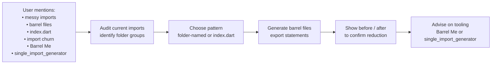
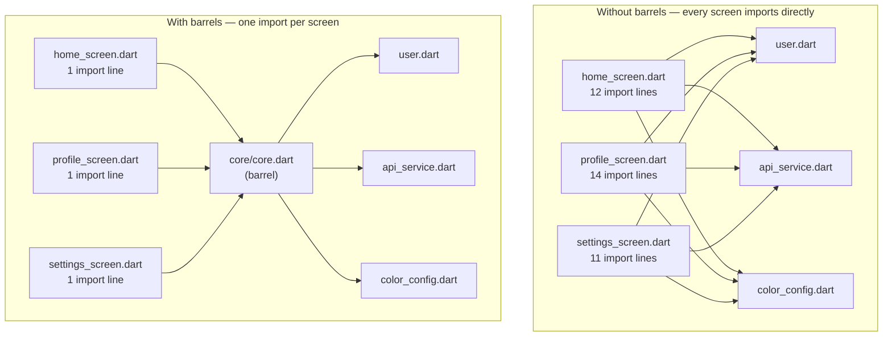
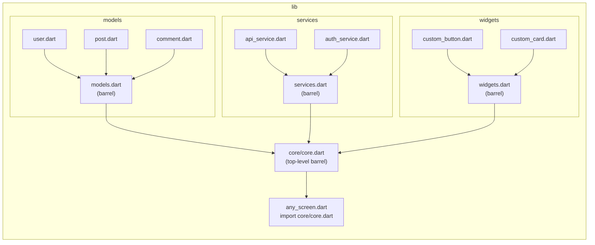
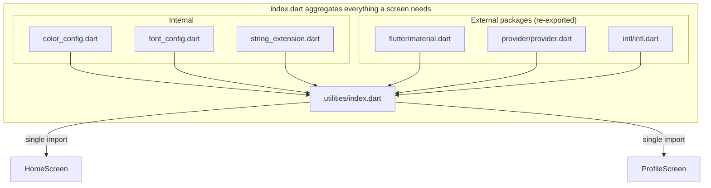
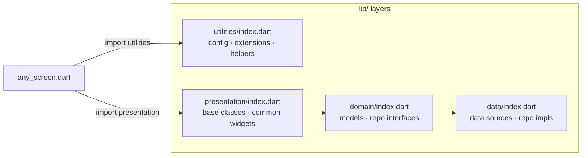
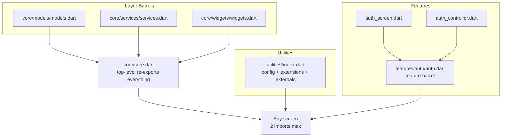
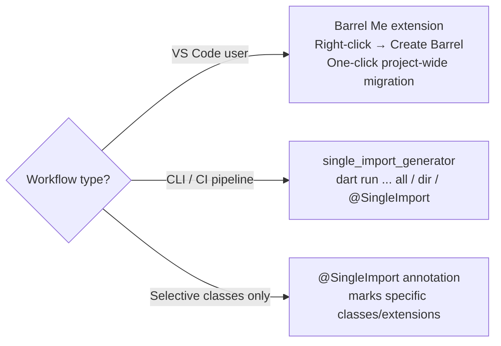
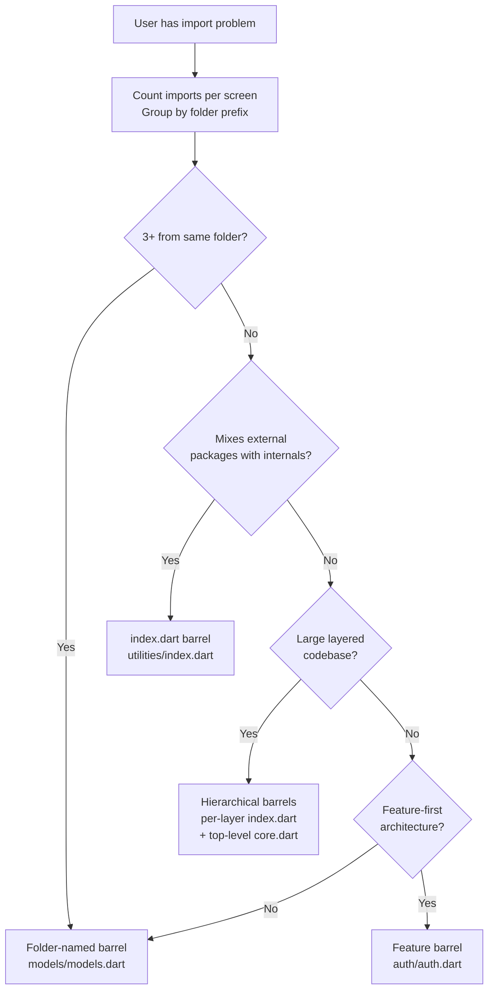

# Flutter Barrel Imports Skill

A skill for cleaning up Flutter/Dart import sections using the **barrel file pattern** —
consolidating multiple `import` statements into a single re-export entry point.
Two naming styles exist: folder-named barrels (`models.dart`) and the
`index.dart` convention. Both are covered here.

---

## How the Skill Activates



---

## Why Imports Become a Problem



**Pain points without barrels:**
- Repetitive boilerplate every time a new screen/widget is created
- Unnecessary Git merge conflicts when import lines change across branches
- Unused or duplicate imports accumulate and hurt readability

> Run `dart fix --apply` to auto-remove unused import statements before migrating.

---

## Approach 1 — Folder-Named Barrel Files (`models.dart`)

Name the barrel after its folder. Best for **layer-based architectures** (models / services / widgets).



### Step 1 — Create per-folder barrel files

```dart
// lib/models/models.dart
export 'user.dart';
export 'post.dart';
export 'comment.dart';
```

```dart
// lib/services/services.dart
export 'api_service.dart';
export 'auth_service.dart';
```

```dart
// lib/widgets/widgets.dart
export 'custom_button.dart';
export 'custom_card.dart';
export 'loading_indicator.dart';
```

### Step 2 — Create a top-level core barrel (optional)

```dart
// lib/core/core.dart
export 'models/models.dart';
export 'services/services.dart';
export 'widgets/widgets.dart';
```

### Step 3 — Replace scattered imports with one line

```dart
// Before
import 'package:myapp/models/user.dart';
import 'package:myapp/models/post.dart';
import 'package:myapp/services/api_service.dart';
// ...

// After
import 'package:myapp/core/core.dart';
```

---

## Approach 2 — `index.dart` (Single Import Convention)

Use `index.dart` as the barrel name — common in projects that mix internal and external exports in one place. Ideal for a `utilities/` or `app/` root.



### Create `lib/utilities/index.dart`

```dart
// lib/utilities/index.dart

// internal app modules
export 'package:myapp/app/config/color_config.dart';
export 'package:myapp/app/config/font_config.dart';
export 'package:myapp/app/config/app_insets.dart';
export 'package:myapp/utilities/extensions/string_extension.dart';

// frequently used external packages
export 'package:flutter/material.dart';
export 'package:provider/provider.dart';
export 'package:intl/intl.dart';
```

### Import in any screen with one line

```dart
import 'package:myapp/utilities/index.dart';

class HomeScreen extends StatelessWidget {
  // color_config, font_config, material — all available
}
```

### Structured `index.dart` per layer



```dart
import 'package:myapp/utilities/index.dart';
import 'package:myapp/presentation/index.dart';
```

---

## Hierarchical Barrel Architecture (large codebases)



---

## Naming Convention Comparison

| Style | Barrel file name | Best for |
|---|---|---|
| Folder-named | `models/models.dart` | Layer-based architecture |
| index.dart | `utilities/index.dart` | Mixed internal + external exports |
| Feature barrel | `auth/auth.dart` | Feature-first architecture |

**Conflict rule:** If a folder already has a non-barrel file with the same name,
rename the barrel to `{name}_barrel.dart` or fall back to `index.dart`.

---

## What to Exclude from Any Barrel File

- `main.dart` — app entry point, never re-exported
- Dart `part` files — belong to a specific library, cannot be re-exported
- Existing barrels at the same level (avoid circular exports)
- Generated files (`*.g.dart`, `*.freezed.dart`) — import them directly

---

## Automating Barrel Generation



### Option A — `single_import_generator`

```yaml
dev_dependencies:
  single_import_generator: ^<latest>
```

```bash
# All files in directory (recursive)
dart run single_import_generator -target=lib/presentation all

# Immediate files only (non-recursive)
dart run single_import_generator -target=lib/presentation/common dir
```

```dart
// Annotate only what should be barrel-exported
@SingleImport()
class FrequentlyUsedClass { ... }

@SingleImport()
extension SomeStringExtension on String { ... }
```

```bash
dart run single_import_generator -path=lib/utilities
```

### Option B — "Barrel Me" (VS Code Extension)

Right-click any folder → **"Create Barrel"**. Key features:
- Flat or hierarchical barrel generation
- Auto-excludes `main.dart`, `part` files, existing barrels
- Renames conflicting files to `{name}_barrel.dart`
- One-click import migration across the whole project

> Search **"Barrel Me"** in the VS Code Extensions Marketplace.

---

## Agent Decision Flow



---

## When to Apply Which Pattern

| Situation | Recommendation |
|---|---|
| 3+ imports from the same folder | Folder-named barrel |
| Repetitive base imports on every screen | `utilities/index.dart` |
| Mixing external packages with internals | `index.dart` with both export types |
| Large layered app | Hierarchical barrels per layer |
| Feature-based monorepo | Per-feature barrel (`auth/auth.dart`) |
| Existing messy codebase | Barrel Me (VS Code) for one-click migration |
| CLI / CI workflow | `single_import_generator` with `all` or `dir` flag |

---

## Quick Reference Templates

```dart
// Folder-named barrel: lib/<folder>/<folder>.dart
export '<file1>.dart';
export '<file2>.dart';
// omit: main.dart, *.g.dart, *.freezed.dart, part files

// index.dart barrel: lib/utilities/index.dart
export 'package:myapp/app/config/color_config.dart';
export 'package:myapp/utilities/extensions/string_ext.dart';
export 'package:flutter/material.dart';   // external packages OK here
export 'package:provider/provider.dart';
```
