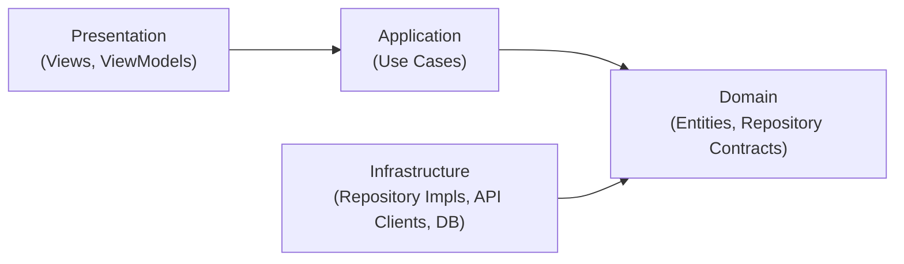

# Initializing Clean Architecture (Presentation / Application / Domain / Infrastructure)

## Contents
- [Why Four Layers](#why-four-layers)
- [The Dependency Rule](#the-dependency-rule)
- [Layer Responsibilities](#layer-responsibilities)
- [Project Structure](#project-structure)
- [Workflow: Initializing a Feature Module](#workflow-initializing-a-feature-module)
- [Examples](#examples)
- [Dependency Injection Wiring](#dependency-injection-wiring)
- [References](#references)

## Why Four Layers

The three-layer UI/Logic/Data split (see `flutter-apply-architecture-best-practices`) is
enough for small apps. Reach for the four-layer split when a feature needs any of:

- Business rules that must stay portable across multiple UIs (mobile, web admin, CLI)
- Multiple data sources per feature (REST, GraphQL, local cache, platform channel) that
  must be swappable without touching business logic
- Use cases that orchestrate more than one repository, or that must be unit-tested with
  zero Flutter/widget dependencies

Splitting **Domain** from **Application** and **Infrastructure** from **Data** isolates
*what the business needs* (Domain) from *how a specific screen uses it* (Application) and
from *how it's technically fetched* (Infrastructure).

## The Dependency Rule

Dependencies only point inward. Outer layers know about inner layers; inner layers never
import outer ones.



`Domain` has no Flutter import and no package dependency on `Infrastructure`.
`Infrastructure` depends on `Domain` only to implement its repository contracts.

## Layer Responsibilities

### Domain
The innermost layer. Pure Dart, no `flutter:` or `http:` imports.
- **Entities:** Immutable business objects (`freezed` or plain classes with `==`/`hashCode`).
- **Repository contracts:** Abstract classes describing *what* data operations exist,
  never *how* they're implemented.
- **Value objects / failures:** Domain-specific validation and error types.

### Application
Orchestrates Domain objects to fulfill one specific use case. No widgets, no direct
network/database calls.
- **Use Cases:** One class per user intent (`GetProfileUseCase`, `SubmitOrderUseCase`).
  Callable classes (`call()` method) that depend only on Domain repository contracts.
- Combine multiple repositories here when a use case spans more than one data source.

### Infrastructure
Implements Domain contracts against real external systems.
- **Repository implementations:** Concrete classes implementing the Domain's abstract
  repositories.
- **Data sources:** API clients, local database wrappers (`sqflite`, `drift`, `Hive`),
  platform channels.
- **DTOs/mappers:** Translate wire/storage formats into Domain entities and back.

### Presentation
Everything Flutter-specific.
- **ViewModels:** Extend `ChangeNotifier` (or use `Bloc`/`Riverpod` notifiers). Depend on
  Application use cases only, never on Infrastructure or Domain repository contracts
  directly.
- **Views:** Lean widgets that render ViewModel state and forward user input to it.

## Project Structure

Group every layer under the feature, so a whole feature — and its dependency direction —
can be reviewed, tested, or deleted as one unit.

```text
lib/
└── features/
    └── profile/
        ├── domain/
        │   ├── entities/
        │   │   └── user.dart
        │   └── repositories/
        │       └── user_repository.dart          # abstract contract
        ├── application/
        │   └── use_cases/
        │       └── get_profile_use_case.dart
        ├── infrastructure/
        │   ├── dtos/
        │   │   └── user_dto.dart
        │   ├── datasources/
        │   │   └── user_remote_data_source.dart
        │   └── repositories/
        │       └── user_repository_impl.dart      # implements domain contract
        └── presentation/
            ├── view_models/
            │   └── profile_view_model.dart
            └── views/
                └── profile_view.dart
```

Shared, cross-feature Domain contracts (e.g. `AuthRepository`) live in
`lib/core/domain/`, with their Infrastructure implementations in `lib/core/infrastructure/`.

## Workflow: Initializing a Feature Module

Copy this checklist when scaffolding a new feature under `lib/features/<feature_name>/`.

### Task Progress
- [ ] **Step 1: Create the four layer directories.** `domain/`, `application/`, `infrastructure/`, `presentation/`, each with their subfolders from the structure above.
- [ ] **Step 2: Define Domain entities.** Immutable, Flutter-free data classes.
- [ ] **Step 3: Define the Domain repository contract.** An abstract class listing the operations the Application layer needs — return `Future<Result<T, Failure>>` or throw typed `Failure`s, never raw `DioException`/`PlatformException`.
- [ ] **Step 4: Implement Infrastructure.** Data source(s), DTOs with `fromJson`/`toDomain` mappers, and a repository implementation satisfying Step 3's contract.
- [ ] **Step 5: Implement Application use cases.** One callable class per user intent, injected with the Domain contract (never the Infrastructure implementation type).
- [ ] **Step 6: Implement Presentation.** ViewModel injected with use cases; View rendering ViewModel state.
- [ ] **Step 7: Wire dependency injection.** Register the concrete Infrastructure repository against the Domain abstract type; register use cases and ViewModels. See [Dependency Injection Wiring](#dependency-injection-wiring).
- [ ] **Step 8: Validate the boundary.** Confirm `domain/` and `application/` have zero imports from `infrastructure/` or `flutter/`. Run unit tests for use cases with a fake repository — no widget test harness required.
  - *Feedback Loop:* Import-lint or grep for `package:flutter` inside `domain/`/`application/` → fix any violation → re-check.

## Examples

### Domain: Entity and Repository Contract

```dart
// domain/entities/user.dart
class User {
  const User({required this.id, required this.name, required this.email});

  final String id;
  final String name;
  final String email;
}

// domain/repositories/user_repository.dart
abstract class UserRepository {
  Future<User> getUser(String id);
}
```

### Infrastructure: DTO, Data Source, Repository Implementation

```dart
// infrastructure/dtos/user_dto.dart
class UserDto {
  const UserDto({required this.id, required this.fullName, required this.email});

  factory UserDto.fromJson(Map<String, dynamic> json) => UserDto(
        id: json['id'] as String,
        fullName: json['full_name'] as String,
        email: json['email'] as String,
      );

  final String id;
  final String fullName;
  final String email;

  User toDomain() => User(id: id, name: fullName, email: email);
}

// infrastructure/datasources/user_remote_data_source.dart
class UserRemoteDataSource {
  UserRemoteDataSource({required this.httpClient});

  final HttpClient httpClient;

  Future<UserDto> fetchUser(String id) async {
    final response = await httpClient.get('/users/$id');
    return UserDto.fromJson(response.data as Map<String, dynamic>);
  }
}

// infrastructure/repositories/user_repository_impl.dart
class UserRepositoryImpl implements UserRepository {
  UserRepositoryImpl({required this.remoteDataSource});

  final UserRemoteDataSource remoteDataSource;

  @override
  Future<User> getUser(String id) async {
    final dto = await remoteDataSource.fetchUser(id);
    return dto.toDomain();
  }
}
```

### Application: Use Case

```dart
// application/use_cases/get_profile_use_case.dart
class GetProfileUseCase {
  GetProfileUseCase({required this.userRepository});

  final UserRepository userRepository;

  Future<User> call(String userId) => userRepository.getUser(userId);
}
```

### Presentation: ViewModel and View

```dart
// presentation/view_models/profile_view_model.dart
class ProfileViewModel extends ChangeNotifier {
  ProfileViewModel({required this.getProfileUseCase});

  final GetProfileUseCase getProfileUseCase;

  User? _user;
  User? get user => _user;

  bool _isLoading = false;
  bool get isLoading => _isLoading;

  Future<void> load(String userId) async {
    _isLoading = true;
    notifyListeners();
    try {
      _user = await getProfileUseCase(userId);
    } finally {
      _isLoading = false;
      notifyListeners();
    }
  }
}

// presentation/views/profile_view.dart
class ProfileView extends StatelessWidget {
  const ProfileView({super.key, required this.viewModel});

  final ProfileViewModel viewModel;

  @override
  Widget build(BuildContext context) {
    return ListenableBuilder(
      listenable: viewModel,
      builder: (context, _) {
        if (viewModel.isLoading) {
          return const Center(child: CircularProgressIndicator());
        }
        final user = viewModel.user;
        if (user == null) {
          return const Center(child: Text('No profile loaded'));
        }
        return Column(children: [Text(user.name), Text(user.email)]);
      },
    );
  }
}
```

## Dependency Injection Wiring

Register the Infrastructure implementation against the Domain abstract type so
Presentation and Application never see the concrete class name.

```dart
final getIt = GetIt.instance;

void configureProfileFeature() {
  getIt.registerLazySingleton<UserRemoteDataSource>(
    () => UserRemoteDataSource(httpClient: getIt()),
  );
  getIt.registerLazySingleton<UserRepository>(
    () => UserRepositoryImpl(remoteDataSource: getIt()),
  );
  getIt.registerFactory<GetProfileUseCase>(
    () => GetProfileUseCase(userRepository: getIt()),
  );
  getIt.registerFactory<ProfileViewModel>(
    () => ProfileViewModel(getProfileUseCase: getIt()),
  );
}
```

## References

- [Flutter: Guide to app architecture](https://docs.flutter.dev/app-architecture/guide)
- [flutter-apply-architecture-best-practices](flutter-apply-architecture-best-practices.md) — the lighter three-layer variant this skill extends
