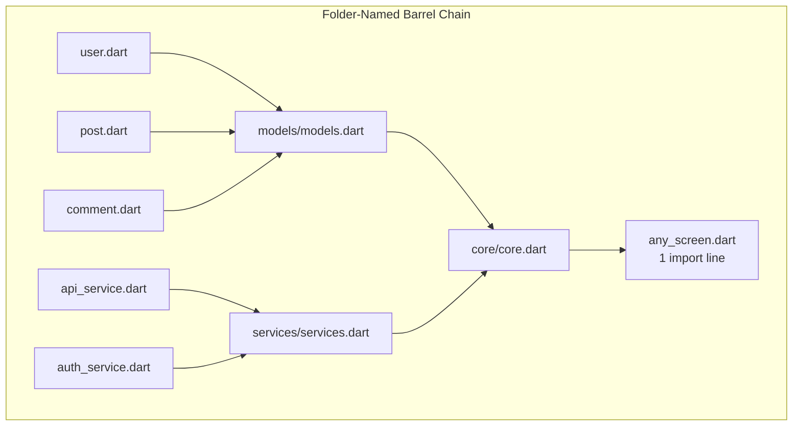
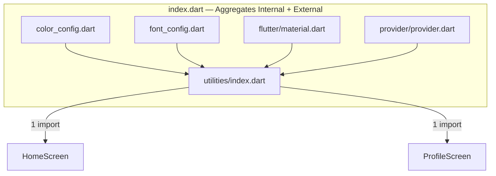
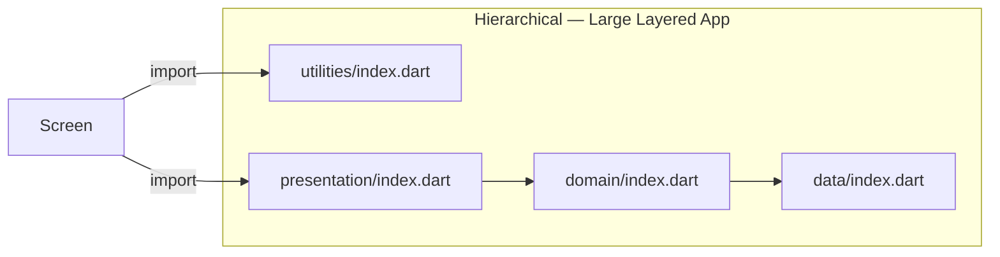
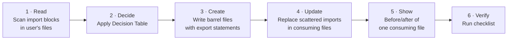

# Flutter Barrel Imports — Agent Skill

---

## AGENT RULES

1. **Never ask the user which barrel pattern to use.** Read their file structure and apply the Decision Table yourself.
2. **Always show a before/after diff** of at least one consuming file so the user sees the import reduction.
3. **Never barrel-export** `main.dart`, `*.g.dart`, `*.freezed.dart`, or Dart `part` files.
4. **Never put barrel files inside a folder that already has a same-named non-barrel file.** Use `{name}_barrel.dart` or fall back to `index.dart`.
5. **After generating barrel files, update every consuming file** that had the scattered imports — don't leave half-migrated code.

---

## Trigger Recognition

Look for these patterns in the user's code:

```
// Pattern A — same folder prefix repeated 3+ times
import 'package:app/models/user.dart';
import 'package:app/models/post.dart';       ← 3 from models/ → create models barrel
import 'package:app/models/comment.dart';

// Pattern B — same block repeated across multiple files
// (same 5+ imports appear at the top of HomeScreen AND ProfileScreen AND SettingsScreen)

// Pattern C — user explicitly mentions one of the trigger keywords above
```

---

## Decision Table — Pick the Right Pattern

| What you observe in the codebase | Pattern to apply |
|---|---|
| 3+ imports from the **same folder**, layered arch (`models/`, `services/`, `widgets/`) | **Folder-named barrel** → `models/models.dart` |
| Same imports (internal + external packages) repeat on **every screen** | **`index.dart`** → `utilities/index.dart` |
| Large app with distinct layers (`domain/`, `data/`, `presentation/`) | **Per-layer `index.dart`** in each layer folder |
| Feature-first architecture (`features/auth/`, `features/cart/`) | **Feature barrel** → `auth/auth.dart` per feature |
| All of the above at once | **Hierarchical** — folder barrels → top-level `core.dart` |
| Existing messy codebase, many files to migrate | Recommend **Barrel Me** (VS Code) or `single_import_generator` CLI |

---

## Architecture Reference







---

## Step-by-Step Execution



### Step 1 — Read

Scan every file the user shows you. Group imports by folder prefix. Count repetitions across files.

### Step 2 — Decide

Apply the Decision Table. Do not ask the user. If two patterns both apply, use the Hierarchical approach.

### Step 3 — Create barrel files

**Export path format — two rules, no exceptions:**

| What you're exporting | Format to use |
|---|---|
| File in the **same folder** as the barrel | `export 'user.dart';` |
| File in **any other folder** (internal or external) | `export 'package:myapp/path/to/file.dart';` |

> **NEVER use relative paths** (`../`, `../../`). Always use `package:` for anything outside the barrel's own folder.

**Folder-named barrel (same-directory exports):**
```dart
// lib/models/models.dart
export 'user.dart';
export 'post.dart';
export 'comment.dart';
// DO NOT export: main.dart, *.g.dart, *.freezed.dart, part files
```

**Top-level core barrel:**
```dart
// lib/core/core.dart
export 'package:myapp/models/models.dart';
export 'package:myapp/services/services.dart';
export 'package:myapp/widgets/widgets.dart';
```

**Feature barrel:**
```dart
// lib/features/auth/auth.dart
export 'auth_screen.dart';
export 'auth_controller.dart';
export 'package:myapp/shared/widgets/primary_button.dart';
export 'package:myapp/services/auth_service.dart';
```

**`index.dart` barrel (utilities/externals mix):**
```dart
// lib/utilities/index.dart
export 'package:myapp/app/config/color_config.dart';
export 'package:myapp/app/config/font_config.dart';
export 'package:flutter/material.dart';
export 'package:provider/provider.dart';
```

### Step 4 — Update consuming files

Replace every group of scattered imports with the single barrel import:

```dart
// BEFORE — remove all of these
import 'package:myapp/models/user.dart';
import 'package:myapp/models/post.dart';
import 'package:myapp/services/api_service.dart';
import 'package:myapp/services/auth_service.dart';

// AFTER — replace with one line
import 'package:myapp/core/core.dart';
```

### Step 5 — Show before/after

Always output a before/after block for at least one consuming file so the user sees the result.

### Step 6 — Advise on automation (if migration is large)

If the user has many files to migrate, add this note:

> **Automate the migration:**
> - VS Code: install **Barrel Me** → right-click folder → "Create Barrel"
> - CLI: `dart run single_import_generator -target=lib/presentation all`
> - Cleanup: `dart fix --apply` removes any newly unused imports

---

## NEVER Generate These

```dart
// ❌ Never use relative paths for cross-folder exports
export '../models/models.dart';
export '../../services/auth_service.dart';
// Use package: instead → export 'package:myapp/services/auth_service.dart';

// ❌ Never re-export main.dart
export 'main.dart';

// ❌ Never re-export generated files
export 'user.g.dart';
export 'user.freezed.dart';

// ❌ Never re-export part files
export 'user_model.part.dart';

// ❌ Never create circular exports (barrel re-exporting another barrel at same level)
// lib/models/models.dart
export 'services/services.dart'; // ← wrong level — belongs in core.dart, not models.dart

// ❌ Never create circular exports (barrel re-exporting another barrel at same level)
// lib/models/models.dart
export 'services/services.dart'; // ← wrong level — belongs in core.dart, not models.dart


// ❌ Never leave consuming files half-migrated
// (some imports replaced, some still scattered)
```

---

## Verify Your Output

Before reporting done, confirm every item:

- [ ] Barrel file created with correct path and name
- [ ] All `export` statements point to files that actually exist
- [ ] No `main.dart`, `*.g.dart`, `*.freezed.dart`, or `part` files exported
- [ ] No circular exports (a barrel re-exporting another barrel at the same level)
- [ ] Every consuming file that had scattered imports now uses the barrel import
- [ ] Before/after shown for at least one consuming file
- [ ] If migration is large: automation tooling mentioned
